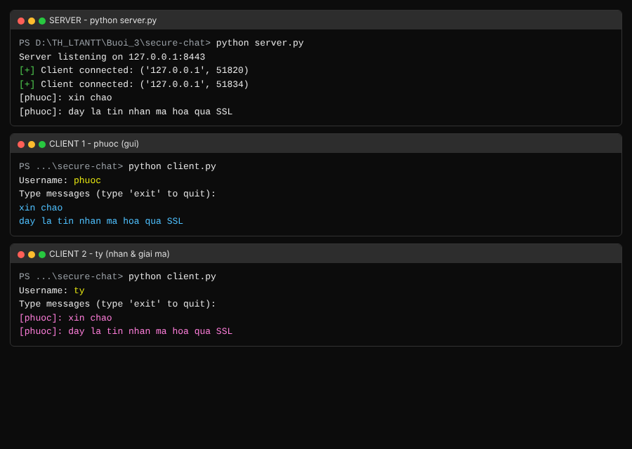
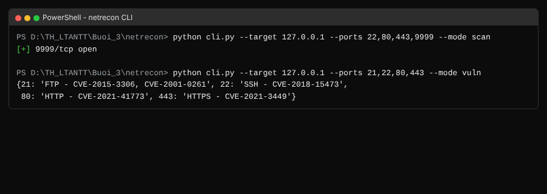
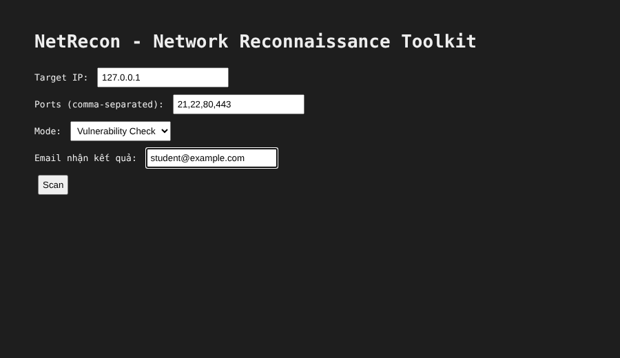
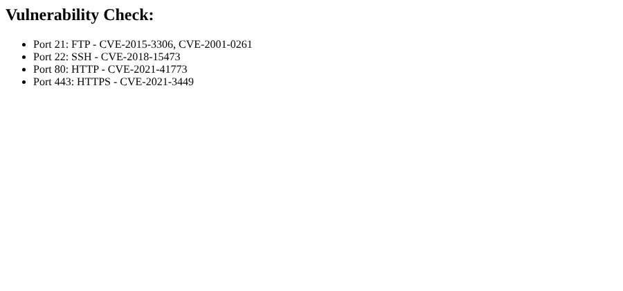
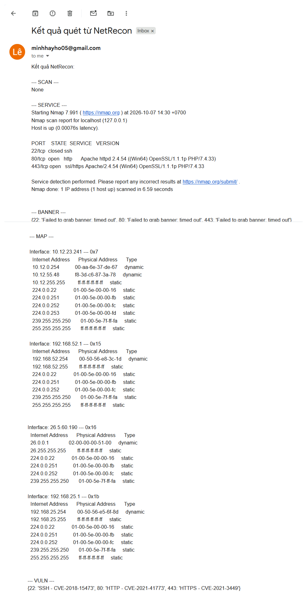

# Bài 3 – Bảo mật mạng máy tính

Báo cáo thực hành gồm 2 phần:

- **SecureChat** – ứng dụng chat đa luồng mã hóa bằng SSL/TLS (xác thực 2 chiều) và mã hóa nội dung tin nhắn bằng AES‑256.
- **Netrecon** – bộ công cụ trinh sát mạng (quét cổng, nhận dạng dịch vụ, lấy banner, vẽ sơ đồ mạng, dò lỗ hổng cơ bản) chạy ở cả 2 dạng CLI và web.

## Cấu trúc thư mục

```
Buoi_3/
├── secure-chat/
│   ├── openssl.cnf              # cấu hình sinh chứng chỉ CA
│   ├── make-certs.bat           # script sinh bộ chứng chỉ ca/server/client
│   ├── message_encryption.py    # mã hóa/giải mã AES-256-CBC
│   ├── connection_manager.py    # quản lý client đang kết nối (thread-safe)
│   ├── room_manager.py          # quản lý phòng chat
│   ├── server.py                # server SSL/TLS đa luồng
│   ├── client.py                # client xác thực chứng chỉ
│   └── certs/                   # chứng chỉ đã sinh sẵn (ca / server / client)
└── netrecon/
    ├── app.py                   # web app Flask
    ├── cli.py                   # giao diện dòng lệnh (click)
    ├── requirements.txt
    ├── .env                     # SMTP_USER / SMTP_PASS (tự tạo – xem mục Cài đặt)
    ├── .gitignore
    ├── modules/
    │   ├── port_scanner.py      # quét cổng bất đồng bộ (asyncio) + rate limit
    │   ├── service_detector.py  # nhận dạng dịch vụ qua nmap -sV
    │   ├── banner_grabber.py    # lấy banner dịch vụ
    │   ├── network_mapper.py    # sơ đồ mạng qua arp -a
    │   ├── vuln_checker.py      # ánh xạ cổng → CVE phổ biến
    │   ├── filter_utils.py      # lọc mục tiêu theo whitelist/blacklist
    │   └── email_sender.py      # gửi kết quả qua Gmail (SMTP SSL)
    ├── templates/               # index.html, layout.html, result.html
    └── static/style.css
```

---

## Phần A – SecureChat

### Cách hoạt động

1. **Kênh truyền an toàn (SSL/TLS 2 chiều).** Server cấu hình `ssl.CERT_REQUIRED` và nạp CA, nên **bắt buộc client phải xuất trình chứng chỉ hợp lệ** (mutual TLS) thì mới bắt tay thành công. Cả server lẫn client đều được ký bởi cùng một CA tự tạo. Server cũng tắt TLS 1.0/1.1 (`OP_NO_TLSv1 | OP_NO_TLSv1_1`) để chỉ dùng từ **TLS 1.2 trở lên**.
2. **Mã hóa nội dung tin nhắn (AES‑256‑CBC).** Ngoài lớp TLS, mỗi tin nhắn còn được mã hóa thêm ở tầng ứng dụng bằng AES‑256‑CBC, padding PKCS7, IV ngẫu nhiên 16 byte ghép vào đầu bản mã (`message_encryption.py`). Khi vào phòng, mỗi client tự sinh khóa AES riêng và gửi cho server; server lưu khóa của từng client (`connection_manager.py`) và khi chuyển tiếp sẽ **mã hóa lại bằng đúng khóa của người nhận**.
3. **Đa luồng & phòng chat.** Mỗi client được phục vụ bằng một thread riêng; `room_manager.py` quản lý việc tạo/join/broadcast theo phòng (mặc định phòng `general`). Truy cập dữ liệu dùng chung được bảo vệ bằng `threading.Lock`.

### Cách chạy

Bộ chứng chỉ đã được sinh sẵn trong `secure-chat/certs/`. Nếu muốn sinh lại (cần cài OpenSSL và thêm vào PATH):

```bat
cd secure-chat
make-certs.bat
```

Mở **3 cửa sổ terminal** trong thư mục `secure-chat`:

```bat
python server.py      :: terminal 1 – server
python client.py      :: terminal 2 – nhập username, ví dụ: phuoc
python client.py      :: terminal 3 – nhập username, ví dụ: ty
```

Gõ tin nhắn ở một client, các client còn lại trong phòng sẽ nhận và giải mã. Gõ `exit` để thoát.

### Kết quả

Client `phuoc` gửi tin, server giải mã → in ra → mã hóa lại bằng khóa của `ty` → `ty` nhận và giải mã đúng:



> Ghi chú: cảnh báo `DeprecationWarning: ssl.OP_NO_TLS* options are deprecated` là bình thường (chỉ là khuyến nghị đổi sang `minimum_version`), không ảnh hưởng chức năng.

---

## Phần B – Netrecon

### Các chức năng chính

| Module | Chức năng | Điểm kỹ thuật |
|---|---|---|
| `port_scanner` | Quét cổng TCP | Bất đồng bộ với `asyncio.open_connection` + `wait_for(timeout=1)`; dùng `Semaphore(rate_limit)` để **giới hạn tốc độ** (mặc định 100 kết nối song song) |
| `service_detector` | Nhận dạng dịch vụ/phiên bản | Gọi `nmap -sV -p <ports> <ip>` |
| `banner_grabber` | Lấy banner dịch vụ | Kết nối socket, `recv(1024)`, timeout 2s |
| `network_mapper` | Vẽ sơ đồ mạng nội bộ | Đọc bảng ARP bằng `arp -a` |
| `vuln_checker` | Dò lỗ hổng cơ bản | Ánh xạ cổng phổ biến → CVE tham khảo |
| `filter_utils` | Lọc mục tiêu | Hỗ trợ whitelist/blacklist |
| `email_sender` | Gửi báo cáo | SMTP SSL qua Gmail (port 465) |

Mọi hoạt động đều được **ghi log kèm thời gian** vào `netrecon.log`.

### Cài đặt

```bat
cd netrecon
pip install flask click python-dotenv
```

> `requirements.txt` giữ nguyên theo tài liệu (`flask, click, asyncio, htmx, python-dotenv`). Thực tế code chỉ cần **flask / click / python-dotenv**: `asyncio` đã nằm sẵn trong thư viện chuẩn của Python, còn `htmx` là thư viện JavaScript (không cần cho phần Python).

Tạo file `netrecon/.env` (chỉ cần khi dùng tính năng gửi email ở bản web). Lấy *App Password* 16 ký tự tại <https://myaccount.google.com/apppasswords>:

```
SMTP_USER=email_cua_ban@gmail.com
SMTP_PASS=app_password_16_ky_tu
```

### Chạy bản CLI

```bat
python cli.py --target 127.0.0.1 --ports 22,80,443 --mode scan
python cli.py --target <ip> --ports 21,22,80,443 --mode all
```

`--mode`: `scan` | `service` | `banner` | `map` | `vuln` | `all`.



### Chạy bản Web

```bat
python app.py
```

Mở <http://localhost:5000>, nhập mục tiêu, chọn chế độ rồi bấm **Scan**. Kết quả hiển thị trên trang và (nếu đã cấu hình `.env`) được gửi về email.

| Giao diện nhập liệu | Trang kết quả |
|---|---|
|  |  |

Sau khi bấm **Scan**, kết quả còn được gửi về email đã nhập (cấu hình trong `.env`). Email nhận được trong hộp thư:



---

## Tóm tắt kiểm thử

| Hạng mục | Kết quả |
|---|---|
| Sinh & xác minh chứng chỉ (server/client ký bởi CA) | ✅ `openssl verify` OK |
| AES‑256‑CBC mã hóa ↔ giải mã | ✅ roundtrip khớp |
| Chat qua TLS 2 chiều, 2 client trao đổi tin | ✅ nhận & giải mã đúng |
| Import toàn bộ module Netrecon + `cli.py` + `app.py` | ✅ không lỗi |
| Quét cổng bất đồng bộ (phát hiện cổng đang mở) | ✅ phát hiện đúng cổng mở |
| `vuln_checker`, `filter_utils` (whitelist/blacklist) | ✅ đúng logic |
| Web app: route `/` và `/scan` render `result.html` | ✅ HTTP 200, hiển thị kết quả |
| Gửi email kết quả qua Gmail (SMTP SSL) | ✅ nhận được email "Kết quả quét từ NetRecon" |

> `service_detector` (nmap) và `network_mapper` (arp) phụ thuộc công cụ hệ thống nên chạy trực tiếp trên Windows (máy đã cài sẵn Nmap).

## Lưu ý bảo mật

- **Chỉ quét trên hệ thống mình sở hữu hoặc được cho phép.** Để thử nghiệm hợp pháp, Nmap cung cấp sẵn mục tiêu `scanme.nmap.org`. Việc quét trái phép có thể vi phạm quy định.
- Cơ chế rate‑limit và ghi log trong Netrecon giúp tránh gây quá tải mục tiêu và phục vụ truy vết.
- Với SecureChat, do khóa AES của client được gửi lên server nên **server vẫn đọc được nội dung** (mô hình đơn giản của bài lab). Muốn end‑to‑end thật sự, nên trao đổi khóa trực tiếp giữa các client (ví dụ Diffie‑Hellman) để server không giữ khóa.
- Không commit file `.env` và thư mục `certs/` (đã khai báo trong `.gitignore`).
