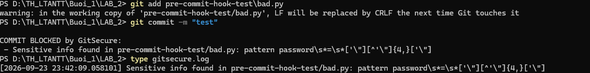

# GitSecure — Pre-commit Hook

Bài thực hành 1.4 — Bảo mật trước khi commit. Hệ thống pre-commit hook tự động
kiểm tra mã nguồn trước mỗi lần `git commit`, phát hiện và **chặn** commit nếu có
rủi ro bảo mật.

## Chức năng

- Quét thông tin nhạy cảm bị hardcode (password, apikey, token, secret, AWS key).
- Kiểm tra quyền truy cập file (bỏ qua trên Windows).
- Quét lỗ hổng bằng **Bandit**.
- Ghi lại các phát hiện vào `gitsecure.log`.
- Chặn commit (`exit 1`) nếu phát hiện bất kỳ vấn đề nào.

## Cấu trúc

```
LAB_2/
├── .githooks/
│   └── pre-commit          # Script kiểm tra
├── pre-commit-hook-test/
│   └── bad.py              # File test (chứa password để thử chặn)
├── requirements.txt        # bandit
└── .gitignore
```

## Cài đặt

```bash
git config core.hooksPath .githooks
pip install -r requirements.txt
```

## Kết quả kiểm thử

Tạo file `pre-commit-hook-test/bad.py` chứa `password = "123456"` rồi thử commit.
Hook đã **chặn commit** và ghi log như hình dưới:



Nội dung ghi vào `gitsecure.log`:

```
[2026-09-23 23:42:09] Sensitive info found in pre-commit-hook-test/bad.py: pattern password...
```
