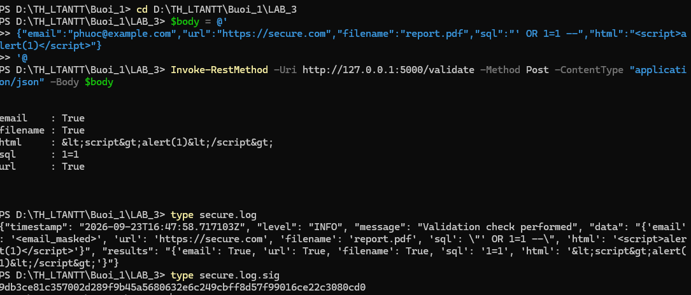

# SecureLogger — Ghi nhật ký ưu tiên bảo mật

Bài thực hành 1.6 — Hệ thống ghi log an toàn, tích hợp với thư viện
SecureValidator để ghi lại mọi lần kiểm tra dữ liệu.

## Chức năng

- Ghi log đa cấp độ (DEBUG, INFO, WARNING, ERROR, CRITICAL).
- Tự động che (mask) thông tin định danh cá nhân — PII (email, token…).
- Luân phiên log (rotation) kèm nén `.gz`.
- Phát hiện thay đổi trái phép qua chữ ký băm (`secure.log.sig`).
- Ghi log theo cấu trúc JSON.

## Cấu trúc

```
LAB_3/
├── app.py                  # API /validate (POST)
├── requirements.txt        # Flask
├── securevalidator/        # Thư viện từ bài 1.2
│   ├── __init__.py
│   └── core.py
└── securelogger/
    ├── __init__.py
    └── logger.py           # Module ghi log an toàn
```

## Cài đặt & chạy

```bash
pip install -r requirements.txt
python app.py
```

Server chạy tại `http://127.0.0.1:5000`. Endpoint: `POST /validate` (nhận JSON).
Lưu ý: **không có route `/`** nên mở trình duyệt vào trang chủ sẽ trả 404 — đây
là bình thường, phải gửi POST tới `/validate`.

## Kiểm thử

Gửi một request và quan sát kết quả + log:



- Response trả về JSON kết quả validation.
- `secure.log`: dòng JSON, phần email hiển thị `<email_masked>` (PII đã bị che).
- `secure.log.sig`: mã băm SHA-256 dùng để kiểm tra log có bị chỉnh sửa hay không.
